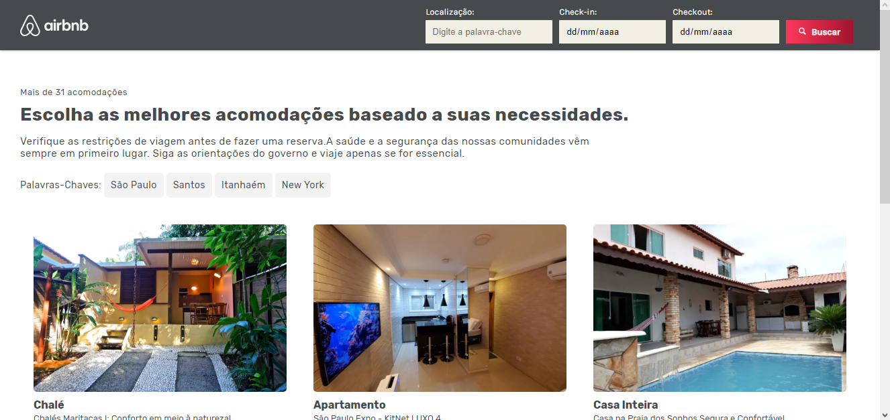
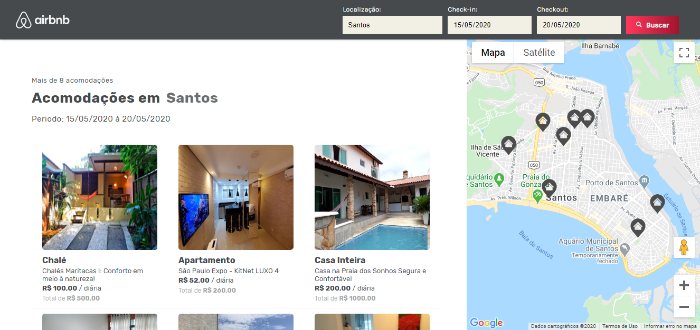

# Airbnb - GamaAcademy
> Projeto inspirado no site Airbnb, para fins de estudo e realização de suas funcionalidades

## Histórico de lançamentos
-

## Envolvidos no desenvolvimento

Jorge Henrique – [@LinkedIn](https://www.linkedin.com/in/jorge-henrique-baptista/) – jorgehenrique@live.com

The MIT License (MIT)

Copyright (c) 2020
